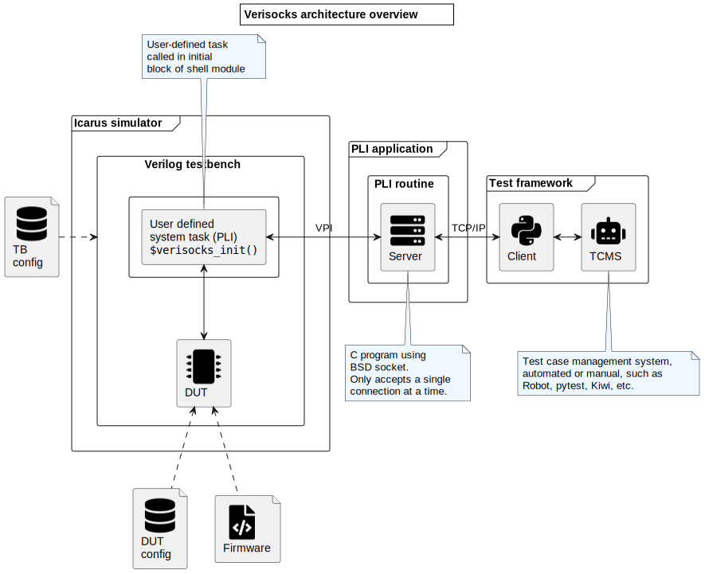

# Verisocks - *A generic socket interface for Icarus*

[Github](https://github.com/jchabloz/verisocks)

## Introduction

When using an HDL simulator such as [Icarus](http://iverilog.icarus.com) which
provides only a limited possible support for advanced verification
methodologies, the following challenges have to be faced:

* How to define and perform regression tests?
* How to define and execute simple or complex pass/fail criteria?
* How to establish traceability between testcases and requirements?
* etc.

While these issues could be adressed with advanced verification methodologies
and frameworks such as
[UVM](https://en.wikipedia.org/wiki/Universal_Verification_Methodology), it is
relatively difficult to put into place with Icarus.

The idea that I propose to explore here comes out of my trying to use the
[cocotb](https://docs.cocotb.org) environment to meet some of the needs listed
above. The *cocotb* tool, is described as a *Python verification framework* and
uses extensively asynchronous I/O techniques (hence the name, which stands for
*coroutine based cosimulation testbench*). I made mine the statement that can
be found on the [cocotb documentation main
page](https://docs.cocotb.org/en/stable/):

> All verification is done using Python which has various advantages over using
> SystemVerilog or VHDL for verification:
> 
> * Writing Python is fast - it’s a very productive language.
> * It’s easy to interface to other languages from Python.
> * Python has a huge library of existing code to re-use.
> * Python is interpreted - tests can be edited and re-run without having to
>   recompile the design.
> * Python is popular - far more engineers know Python than SystemVerilog or
>   VHDL.

I soon realized that it was indeed really nice to be able to define and execute
tests using Python! I was however a bit disappointed by the so-called
*regression manager* implementation proposed by cocotb and started to wonder
why redo what is already done so well (and much more completely) by tests
frameworks such as [pytest](https://docs.pytest.org) or
[robot](https://robotframework.org)?

Some workaround can be found, such as for example
[cocotb-test](https://github.com/themperek/cocotb-test) which proposes a
solution to use pytest with cocotb, but I am not entirely convinced.

I prefer trying another solution (it's more fun anyway); re-write from scratch
a simple-to-use interface using the standardized *Verilog Procedural Interface
(VPI)* to make it possible to control an Icarus simulation (this could normally
easily be extended to any Verilog simulator later) from Python.

## Installation

Simply run the usual instructions:

```sh
./configure
make
```

Depending on where is your local installation of Icarus, you will have to run
the `configure` script indicating the path to `vpi_user.h` and `libvpi.a` as
the script will check for their availability.

For example:

```sh
./configure CFLAGS=-I$HOME/local/include LDFLAGS=-L$HOME/local/lib
make
```

The `make` invocation will compile the VPI module to `build/verisocks.vpi`,
which can then be used to be loaded when desiring to use Verisocks with `vvp`.

In order to test the installation, make sure to use a Python >=3.4 with pytest
installed (as usual, best practice would recommend to use a virtual environment)

```sh
python -m pip install --upgrade pip
python -m pip install pytest build
python -m pip install -e ./python
python -m pytest
```

## Architecture

The diagram in the figure below describes the high-level architecture for
Verisocks.



The verilog testbench has to include a `$verilog_init()` statement, usually at
the beginning of an `initial` statement (even though it can also be later).
This statement takes one mandatory argument which is the port number to which
the server needs to be associated and one optional argument defining the
timeout in seconds which should apply while waiting for a client connection:
The default timeout value is 120s (2mn).

```verilog
$verisocks_init(num_port[, timeout_sec]);
```

The main working principle for Verisocks is that the focus of the simulation is
either taken by the simulator, or by Verisocks. While Verisocks has the focus,
the simulation is stopped and the simulation time does not advance. At this
point, it is possible to query or force values of the simulator.

In order to advance the simulation, the focus needs to be relaxed to the
simulator by either completely exiting Verisocks, in which case the simulation
will run its course until it is finished, or to instruct the simulator to run
until a certain event or a certain time.

All of the instructions and return messages to and from the simulator are using
the Verisocks TCP socket and uses the same TCP protocol.

While the documentation is still missing, please refer to the provided examples
and the [Python client code](python/verisocks/verisocks.py).

## TCP protocol

### Message format

The TCP message format follows the proposal for a message format in the
[RealPython's guide on sockets
programming](https://realpython.com/python-sockets/) as it seems to be quite
reasonable and generic. Indeed, it allows to deal easily with variable-length
messages while making sure that we can easily verify the that the full message
has been received and/or is not overlapping with the next message. Moreover,
while it is not really foreseen at the time to be used in this project, it
allows to cope with the transmission of binary data.

The message format can be summarized as follows:

1. Fixed-length pre-header: Indicates the length in bytes of the following
   variable-length header.
   * Type: Integer value
   * Encoding: Big endian byte ordering
   * Length: 2 bytes
2. Variable-length header: Gives information on the message payload's content.
   * Type: Unicode text, JSON format
   * Encoding: UTF-8
   * Length: As specified by the integer value in the pre-header
3. Variable-length payload
   * Type: As specified in the header
   * Encoding: As specified in the header, only UTF-8 currently supported.
   * Length: As specified in the header

## Miscellaneous references

1. Ultralightweight JSON parser in ANSI C: https://github.com/DaveGamble/cJSON#readme
