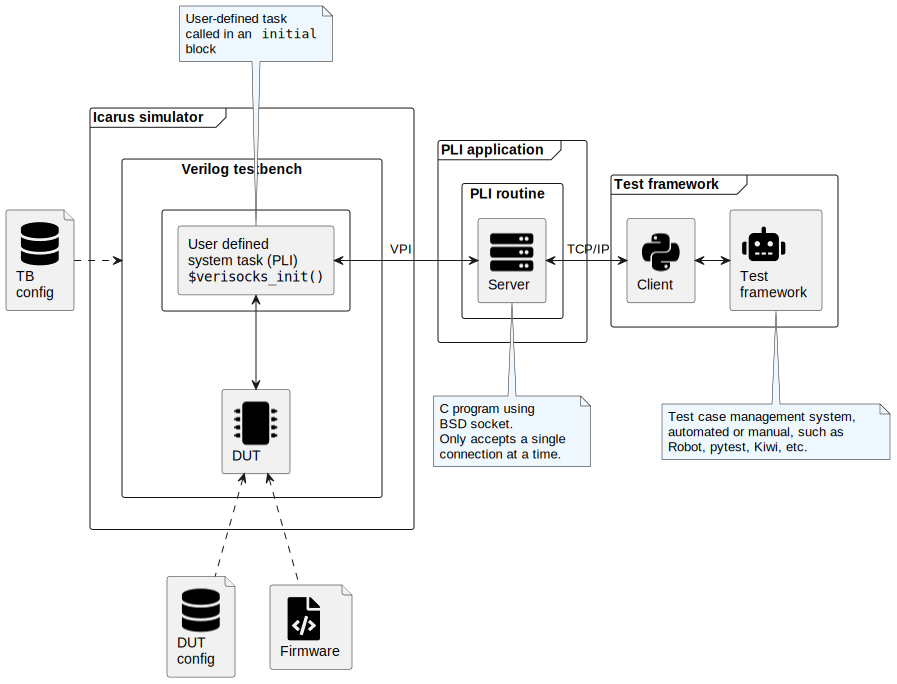

# Verisocks - *A generic socket interface for Icarus*

[](https://github.com/jchabloz/verisocks/actions/workflows/makefile.yml)

Repository: [**github.com/jchabloz/verisocks**](https://github.com/jchabloz/verisocks)<br>
Documentation: [**jchabloz.github.io/verisocks**](https://jchabloz.github.io/verisocks/)

## Introduction

When using an HDL simulator such as [Icarus](http://iverilog.icarus.com) which
provides only a limited possible support for advanced verification
methodologies, the following challenges have to be faced:

* How to define and perform regression tests?
* How to define and verify simple or complex pass/fail criteria?
* How to establish traceability between testcases and requirements?
* etc.

I made mine the statement that can be found on the [cocotb documentation main
page](https://docs.cocotb.org/en/stable/):

> All verification is done using Python which has various advantages over using
> SystemVerilog or VHDL for verification:
> 
> * Writing Python is fast - it’s a very productive language.
> * It’s easy to interface to other languages from Python.
> * Python has a huge library of existing code to re-use.
> * Tests can be edited and re-run without having to recompile the design.
> * Python is popular - far more engineers know Python than SystemVerilog or
>   VHDL.

It is indeed really nice to be able to define and execute tests using Python!
Even more so if it would be possible to use tests frameworks such as
[pytest](https://docs.pytest.org) or [robot](https://robotframework.org).

I decided to try an alternative solution to cocotb (it's more fun anyway);
re-write from scratch a simple-to-use interface using the standardized *Verilog
Procedural Interface (VPI)* to make it possible to control an Icarus simulation
(or ideally, any other Verilog simulator, commercial or not) from Python. And
while we're at it, why not consider a solution which would enable to easily
interface with almost any other high-level scripting language or tool?

## Architecture overview

The diagram in the figure below describes the chosen high-level architecture
for Verisocks. Please refer to the
[documentation](https://jchabloz.github.io/verisocks/) for a more in-depth
description.



The interface relies on a plain BSD, TCP socket with a simple server-client
approach.

The verilog testbench has to include a `$verilog_init()` statement, usually at
the beginning of an `initial` statement. This statement takes one mandatory
argument which is the port number to which the server needs to be associated
and one optional argument defining the timeout in seconds which should apply
while waiting for a client connection:

```verilog
$verisocks_init(num_port[, timeout_sec]);
```

The main working principle for Verisocks is that the focus of the simulation is
either taken by the simulator, or by Verisocks. While Verisocks has the focus,
the simulation is stopped and the simulation time does not advance. At this
point, it is possible for the client application to both query or force values
of the simulator.
