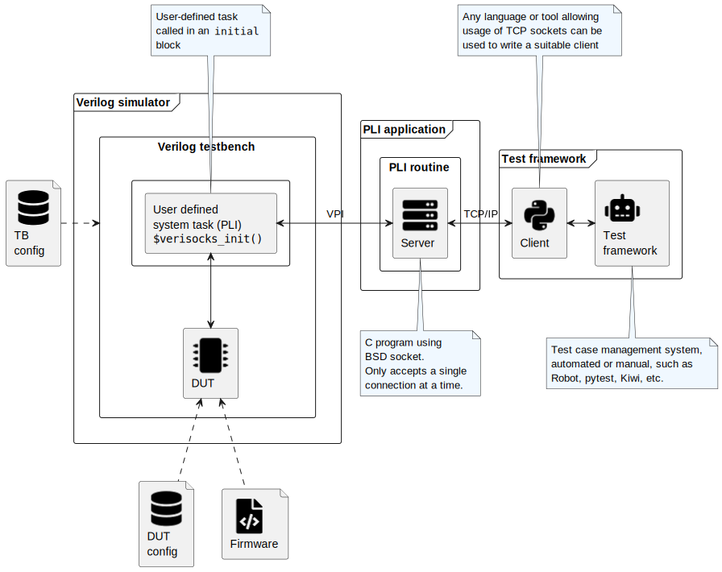

.. sectionauthor:: Jérémie Chabloz
.. role:: verilog(code)
    :language: verilog

.. _sec_architecture:

Architecture
############

.. _sec_architecture_overview:

Overview
********

The *Verisocks* architecture is described in the figure below.

The verilog testbench contains one instance of the user system task
:verilog:`$verisocks_init()`, that launches the Verisocks PLI application.
Typically, this task would be called directly from within an :verilog:`initial`
statement, at the beginning of the simulation (even though this could also be
done later on) in the top-level testbench.

.. caution::

    A given testbench should contain only one single instance of the
    :verilog:`$verisocks_init()` system task. There are some exceptions
    possible, but they do not really make a lot of sense anyway

Once launched, the Verisocks PLI application works as a server, accepting
connection requests from clients over a classical (BSD) TCP socket. As long as
the server is running, it will accept requests which will then trigger
different actions on the simulator via the VPI interface.

When using the provided Verilator integration C++ API, the architecture can
rather be described by the diagram below.

The server-side of Verisocks is here directly run from the top-level C++
testbench instead of being launched as a PLI application. The Verisocks TCP
socket interface is exactly the same as when using VPI with the same commands
(some minor deviations can be observed and are documented later), allowing to
reuse the same client code with either server-side implementation.

.. _sec_architecture_socket:

TCP socket
**********

The use of a `BSD TCP socket
<https://docs.freebsd.org/en/books/developers-handbook/sockets/>`_ has been
chosen here as a convenient form of interprocess communication (IPC) between
Verisocks and a test framework client, for the sake of portability, as many
possible languages and frameworks on multiple platforms are supporting such
sockets "out of the box". It also allows to potentially run the server and the
client on separate machines or run and control several simulations in parallel
on several different machines.

.. caution::

    Running client and server on separate machines as well as
    parallel/distributed execution of test cases has not been tested yet by the
    author!

The protocol used for the TCP messages is described in detail in the section
:ref:`sec_tcp_protocol`.

.. _sec_architecture_focus:

Shared execution focus
**********************

A key notion has to be understood; the *execution focus*. It is shared between
the simulator and Verisocks (PLI application). When Verisocks has the focus, it
will process requests sent by the client over the socket and the simulator is
"blocked" (the simulation time does not progress). When Verisocks releases the
focus to the simulator, the simulation runs and during this time requests sent
by the client to Verisocks would be queued but not processed.

The execution focus passes from the simulator to Verisocks in the following
cases:

#. Initial :verilog:`$verisocks_init()` system task execution
#. Callback from simulator when the conditions defined in the latest ``run``
   request
#. Directly after a ``finish`` request has terminated the simulation.
#. Directly after a ``stop`` request has stopped the simulation.

The execution focus passes from Verisocks to the simulator in the following
cases:

#. ``run`` request,
#. ``finish`` request; in this case, the focus goes to the simulator, the
   simulation is finished and the focus is directly returned to Verisocks.
   Verisocks exits and the connection is closed from the server side.
#. ``exit`` request; in this specific case, the focus never returns to
   Verisocks and the simulation runs until it finally ends.

This mechanism is partially illustrated by the sequence diagram below.

.. note:: 

    This *blocking* behavior stems from the architectural choice to leave all
    the management of concurrent execution and time to the simulator. HDL
    simulators are inherently good at that!

.. _sec_verisocks_init:

The :verilog:`$verisocks_init()` PLI system task
************************************************

As described in the previous sections, running Verisocks from any Verilog
testbench only requires to use once the :verilog:`$verisocks_init()` system
task. This is easily done in the top-level testbench code as follows:

.. code-block:: verilog

    #define VS_PORT 5100
    #define VS_TIMEOUT 120.0

    //[...]

    initial begin

        //[...]

        $verisocks_init(`VS_PORT, `VS_TIMEOUT);

        //[...]

    end

.. caution::

    Only run the :verilog:`$verisocks_init()` once in a given testbench. It is
    potentially possible to run several instances of the Verisocks server in
    parallel in order to serve some specific use cases, but it is not
    recommended.

Note that it is not mandatory to run this task at the very beginning of the
testbench :verilog:`initial` statement. Any number of statements can be run
prior to using this system task.

Arguments
---------

* **Port number**: This first argument is *mandatory* and defines the port
  number to be used for the TCP socket. It has to be an integer number,
  corresponding to a free port.
* **Timeout**: This second argument is optional and defines the socket timeout
  in seconds (default value :verilog:`120.0`).

